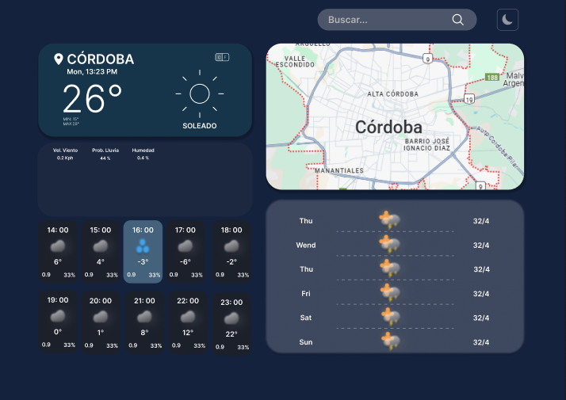

# 🌦️ Weather App

Aplicación web para consultar el clima en tiempo real, creada con **Vite + React** para practicar el consumo de APIs.

## 🔑 Tecnologías Utilizadas

- Vite + React ⚡
- TailwindCSS 💅
- ShadCN (Dark Mode + Componentes) 🎨
- React Lucide (Iconos) 🔥
- API de Clima (OpenWeather) 🌐

## 🎯 Funcionalidades

- Consulta de clima por ciudad
- Modo claro/oscuro con ShadCN
- Diseño responsive
- Carga de datos desde API externa

## ⚙️ Instalación

1. Clonar el repositorio:

```bash
git clone https://github.com/tuUsuario/weather-app.git
```

2. Instalar dependencias:

```bash
cd weather-app
npm install o pnpm install
```

3. Agregar tu clave de API en el archivo `.env`

```bash
VITE_API_KEY=tu_api_key
```

4. Iniciar el servidor:

```bash
npm run dev o pnpm run dev
```

## 🎨 Modo Oscuro

El modo oscuro está implementado usando **ShadCN** con el sistema de contextos de React.

### Cómo funciona

Se utiliza un Provider para compartir el estado del tema entre todos los componentes.

```tsx
import { ThemeProvider } from '@/components/theme-provider';

<ThemeProvider defaultTheme="dark">
  <App />
</ThemeProvider>
```

## 📄 API Utilizada

- [OpenWeather](https://openweathermap.org/) 🔗

## 🔍 Posibles Mejoras

- Integración de mapa con API (mostrar ubicación de la ciudad elegida)
- Mejoras en la interfaz
- Predicciones para los próximos días

## 🎨 Diseño

Así se ve la maqueta del diseño en Figma:



## Autor

**Alexis Escobar**

🌐 [LinkedIn](https://www.linkedin.com/in/alexis-escobar-95b491184/) | 🐙 [GitHub](https://github.com/alexidev23)

---

💪 Proyecto creado con amor para practicar integración de APIs y tecnologías modernas.

